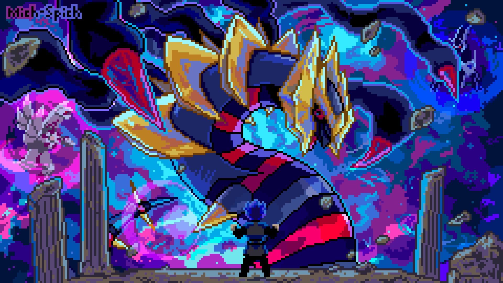

# "Olá mundo!", eu sou o Yuri 👋

  

Estou cursando **Ciência da Computação** e gosto de desenvolver soluções com automação para meus amigos e eu. Atualmente busco evoluir minhas habilidades tanto no desenvolvimento de softwares modernos quanto na integração com hardware(porque acho fascinante o mundo do IOT).

-----------------------------------------------------------------------

## 🛠️ Tecnologias e Ferramentas

### Já utilizo no dia a dia:
* 
*  
*  
*  

### Estou aprendendo e me aprofundando:
*  
*  **(IoT & Hardware)**
---
## 📊 Minhas Estatísticas

  
  

## 🌍 Idiomas
* **Português** 
* **Inglês:** Intermediário 

---

## 📫 Como me encontrar

 wellingtonbethe1618@gmail.com

---
